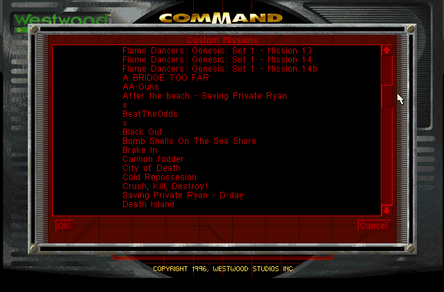

# cncnet-ra-archive-missions

This project tries to convert the Singleplayer Mission Files from the [Red Alert Archive](http://ra.afraid.org/)
for easier access with the [CNCNet RedAlert (Singleplayer)](https://cncnet.org/red-alert)

It should make it easier to play the Missions, instead of download, unzip, fiddle with ini files etc.

# Installation

1. Get and install [CNCNet RedAlert (Singleplayer)](https://cncnet.org/red-alert)
2. Copy Mission file to installation folder. (Alternatively copy all files from Full Collection)

# Result
